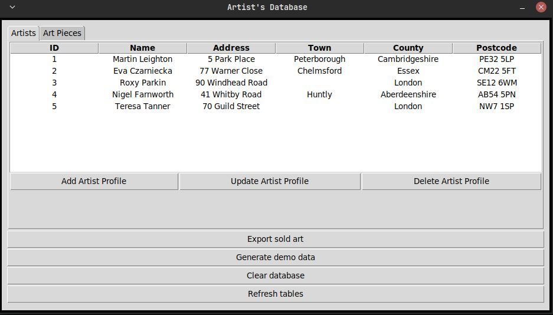
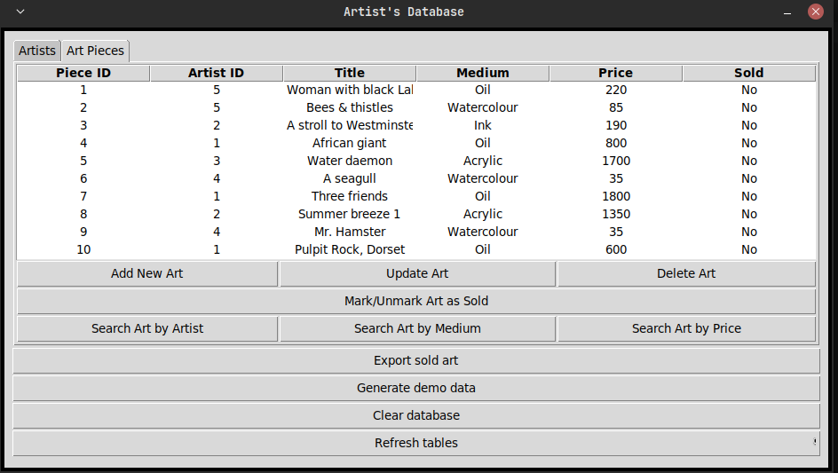

# SOLUTIONS TO LACEY'S 150 PYTHON CHALLENGES

These are my solutions to Nicola Lacey's book. My personal highlight for this solution set is my final project for her book. See screenshots below:

## Challenge 150: Art Gallery Database 

The UI uses `ttk` in addition to convential `Tkinter` methods to create a cleaner grid layout. This applies to other `tkinter` challenges in this solution set.

## 